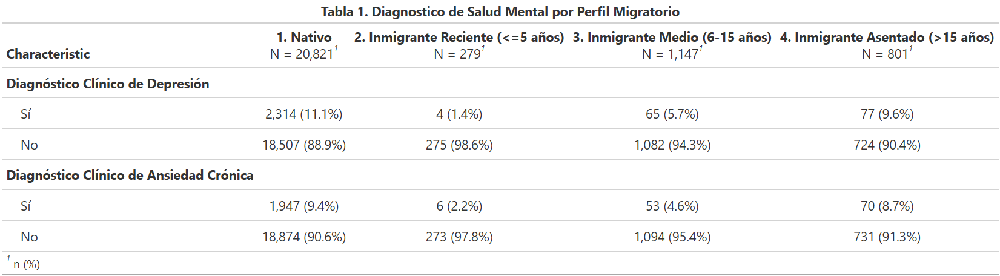
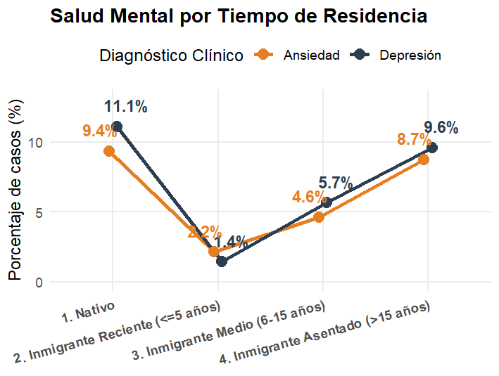
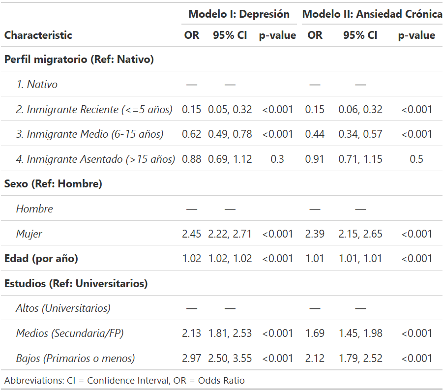
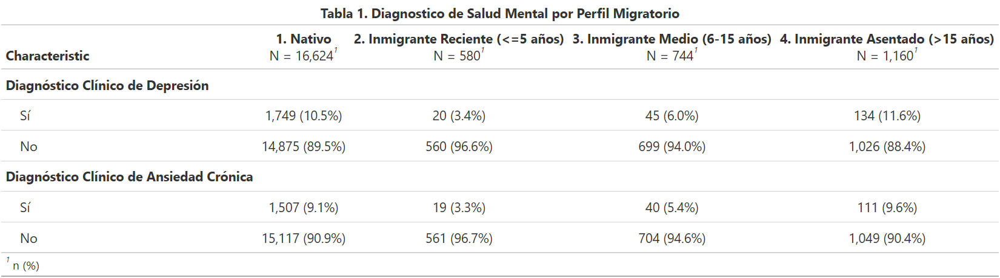
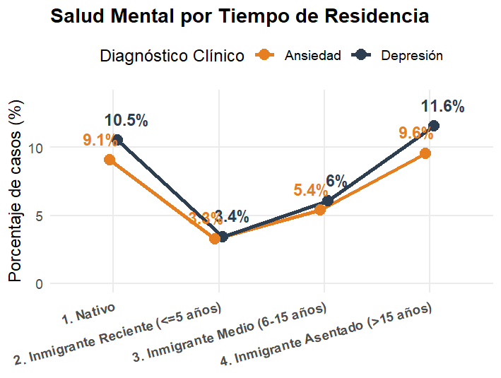
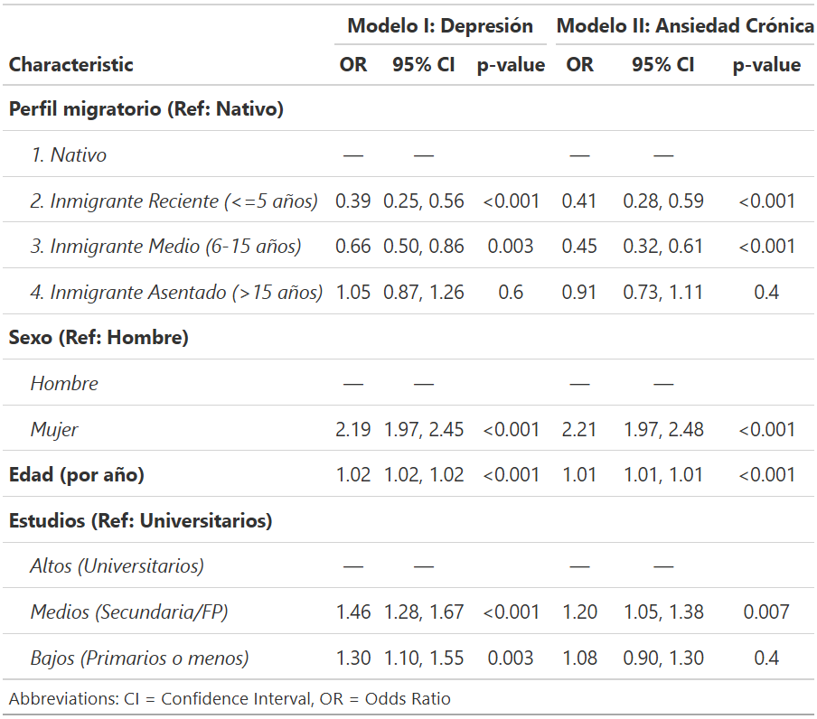

```{r setup, include=FALSE}
knitr::opts_chunk$set(echo = TRUE, eval = FALSE, warning = FALSE, message = FALSE)
```

<style>
h2 {
  padding-top: 10px !important;}
p, li, span, div {
  font-size: 20px !important;
  line-height: 1.5 !important;}
</style>

## Introducción y Objetivos del Estudio

- **Objetivo Central:** Analizar empíricamente el cumplimiento, evolución y posterior desgaste del *"Efecto del Inmigrante Sano"* en España, centrandonos en la dimensión de la salud mental.

- **Enfoque Temporal:** Comparar dos momentos históricos utilizando la Encuesta Nacional de Salud de España (**ENSE 2017**) y la Encuesta de Salud de España (**ESdE 2023**). Estas encuestas permitieron medir un momento previo y posterior a la crisis producida por la COVID-19.

- **Segmentación Clave:** Estratificar a la población nacida en el extranjero según su tiempo de residencia en el territorio nacional y contrastarlos frente a la población autóctona nativa.

## Hipótesis del Trabajo

**1. Paradoja del Inmigrante Sano (Sesgo de Selección):** Los flujos migratorios están compuestos inicialmente por los individuos con mejor capital de salud física y psicológica de sus sociedades de origen. Por tanto, los inmigrantes recién llegados registrarán menores prevalencias de depresión y ansiedad frente a los nativos españoles.

**2. Hipótesis del Desgaste Estructural (Asimilación Epidemiológica):** La exposición prolongada a las condiciones del país de acogida (precariedad en el mercado de trabajo, debilitamiento de las redes de apoyo familiar, barreras de acceso y estrés aculturativo) neutraliza la ventaja inicial. El bienestar psicológico sufrirá un declive lineal progresivo hasta equipararse o empeorar respecto a la población autóctona al superar los 15 años de estancia.

## Metodología y Justificación Estadística

- **Técnica de Análisis:** Regresión Logística Multivariante para estimar razones de ventaja (*Odds Ratios*).
- **Justificación:** Técnica idónea ante variables dependientes cualitativas de naturaleza dicotómica (Presencia/Ausencia de diagnóstico clínico formal de depresión y ansiedad crónica).
- **Variables de Control:** Permite aislar de forma pura el efecto del tiempo de residencia eliminando los sesgos asociados a la composición sociodemográfica de las muestras:
  - Sexo (Categoría de referencia: Hombre)
  - Edad cronológica (Efecto marginal por año cumplido)
  - Nivel de Estudios recodificado (Categoría de referencia: Universitarios / Altos)
- **Además, con el fin de extrapolar los resultados al conjunto de la población, se ha realizado la estimación de los modelos aplicando los factores de elevación y ponderación correspondientes (`FACTORADULTO`).**

## ENSE 2017: Análisis Descriptivo

- **Depresión Clínica:**
  - Población nativa registra un **11,1%** de prevalencia bruta.
  - Cae drásticamente al **1,4%** en el grupo de inmigrantes recién llegados.
  - Escala paulatinamente al **5,7%** en la cohorte media y alcanza el **9,6%** en los asentados.
- **Ansiedad Crónica:**
  - Mismo patron que la depresión.
  - Nativos (**9,4%**) $\rightarrow$ Inmigrantes Recientes (**2,2%**) $\rightarrow$ Inmigrantes Asentados (**8,7%**).
- **Conclusión Preliminar (2017):** Los datos brutos reflejan la existencia de un efecto protector a favor de los inmigrantes recientes. A su vez, esta diferencia casi desaparece en la cohorte de los inmigrantes con 15 o más años en el país.

## ENSE 2017: Tabla Cruzada (Prevalencias)

<center>
  
</center>

## ENSE 2017: Curva de Desgaste Temporal

<center>
  
</center>
<br>
<div style="text-align: center; font-size: 20px !important;">Representación gráfica de las prevalencias muestrales de 2017. Se aprecia de forma clara la forma de "U", con el punto de inflexión mínimo entre los inmigrantes recien llegados.</div>

## ENSE 2017: Análisis Multivariante

- **Inmigrantes Recientes:** Ventaja robusta y altamente significativa ($p < 0.001$). Presentan un riesgo un **85% menor** de depresión ($OR = 0.15$) y ansiedad ($OR = 0.15$) controlado por perfil sociodemográfico.

- **Inmigrantes Medios:** Pérdida gradual de protección ($OR = 0.62$ en depresión y $OR = 0.34$ en ansiedad).

- **Inmigrantes Asentados:** Asimilación completa. Al superar los 15 años ya no vemos una diferencia estadisticamente significativa con los nativos ($p > 0.05$).

## ENSE 2017: Modelos de Regresión

<center>
  
</center>

## ESdE 2023: Análisis Descriptivo

- **Depresión Clínica:**
  - La prevalencia en la población nativa se sitúa en un **10,5%**.
  - Los inmigrantes recién llegados registran apenas un **3,4%** de casos declarados.
  - El grupo con residencia media asciende al **6,0%**, completando el desgaste en los asentados con un **11,6%**.
- **Ansiedad Crónica:**
  - Muestra la misma tendencia que la depresión.
  - Población autóctona presenta un **9,1%** frente a un reducido **3,3%** del colectivo de reciente arribo, escalando al **9,6%** a largo plazo.
- **Estabilidad Temporal:** El diagnóstico descriptivo inicial sigue la misma estructura detectada seis años atrás.

## ESdE 2023: Tabla Cruzada (Prevalencias)

<center>
  
</center>

## ESdE 2023: Curva de Desgaste Temporal

<center>
  
</center>
<br>
<div style="text-align: center; font-size: 20px !important;">El modelado gráfico de los datos brutos de 2023 ratifica la vigencia de la paradoja. Menor riesgo psicológico frente a los nativos de los recien llegados y su posterior escalada, mostrando el desgaste acumulativo en la salud mental del colectivo inmigrante.</div>

## ESdE 2023: Análisis Multivariante

- **Inmigrantes Recientes:** Se mantiene la ventaja protectora de salud mental con un riesgo controlado significativamente menor respecto a los autóctonos nativos españoles ($p < 0.001$).

- **Inmigrantes Medios:** Proceso intermedio de pérdida de la ventaja de salud, aproximándose a los valores de la sociedad de acogida.

- **Inmigrantes Asentados:** Desaparición del efecto protector original. Los coeficientes se igualan al grupo de referencia (Nativos), perdiendo la significación estadística.

## ESdE 2023: Modelos de Regresión

<center>
  
</center>

## Variables de Control

- **El Factor de Género:** En ambos periodos analizados (2017 y 2023), el sexo femenino se consolida como el predictor de riesgo individual más potente, duplicando de forma persistente las probabilidades de sufrir depresión y ansiedad.
- **Efecto de la Edad:** Incremento lineal acumulativo y constante del riesgo por cada año de vida cumplido.
- **Efecto del Nivel Educativo:** En 2017, aquellos con estudios bajos y medios registran un incremento de riesgo frente a los universitarios. En el 2023 el estrato de **estudios medios (Secundaria/FP)** sufre los peores indicadores del modelo, alcanzando un **46% más de riesgo en depresión**. Esto puede evidenciar una mayor vulnerabilidad psíquica de las clases trabajadoras más ligadas a las dinámicas y presiones del mercado laboral activo tras el COVID-19.

## Comparativa Intertemporal (2017 vs. 2023)

- **Invariabilidad de la Estructura:** A pesar de los profundos cambios socioeconómicos e institucionales acaecidos entre 2017 y 2023, la estructura de la curva en "U" permanece inalterada y estadísticamente idéntica.

- **Solidez de la Evidencia:** El "Efecto del Inmigrante Sano" no es un fenómeno coyuntural o pasajero, sino una regularidad epidemiológica estructural en la sociedad española.

- **Dinámica Estructural de Fondo:** El hecho de que la ventaja de salud mental sistemáticamente se disuelva y se sature a los 15 años demuestra que el entorno social y laboral español opera de manera constante como un factor de desgaste para la población de origen extranjero a largo plazo.

## Conclusiones Generales

1. **Cumplimiento de las Hipótesis:** Queda validado el doble proceso: existencia de un sesgo de selección positivo en origen (migrantes sanos) y erosión posterior e ininterrumpida en destino.
2. **El Entorno como Factor Patógeno:** El paulatino deterioro de la salud mental constituye el verdadero "peaje estructural" del proceso de asimilación e integración precaria en las estructuras sociales receptoras.
3. **Resiliencia Estructural frente a la COVID-19:** Aunque la pandemia entre 2017 y 2023 actuó como un estresor generalizado, la curva epidemiológica en "U" se mantuvo inalterada. Esto demuestra que el desgaste del colectivo inmigrante no es producto de una crisis coyuntural, sino de dinámicas propias de la sociedad de acogida.

## Líneas de Investigación Futura

- **Abordaje Metodológico Cualitativo:** Resulta prioritario complementar estos hallazgos con aproximaciones cualitativas (historias de vida, entrevistas en profundidad) para comprender los procesos subjetivos detrás de la erosión de la salud.
- **Diseños de Corte Longitudinal:** Superar la limitación metodológica inherente a los datos de corte transversal mediante el seguimiento y monitorización continuada de cohortes idénticas de migrantes a lo largo de su ciclo vital de residencia.
- **Perspectiva Interseccional Completa:** Profundizar en la interacción simultánea del tiempo de residencia con variables críticas del estatus social y jurídico: la situación administrativa (regular/irregular), el país o región de origen específico y las redes vecinales de apoyo comunitario.

## Referencias Bibliográficas

- Achotegui, J. (2009). Migración y salud mental. El síndrome del inmigrante con estrés crónico y múltiple (síndrome de Ulises). *Zerbitzuan*, (46), 163-171.
- Acosta-Batista, C. (2026). Revisando la paradoja del migrante sano en salud mental: Un enfoque bayesiano. *Gaceta Sanitaria*, *40*, 102576.
- Caicedo, M. (2021). [Reseña del libro *Trabajo y salud mental de los migrantes*]. *Revista Mexicana de Sociología*, *83*(3), 777-781.
- García-Gómez, P., & Oliva, J. (2009). Calidad de vida relacionada con la salud en población inmigrante en edad productiva. *Gaceta Sanitaria*, *23*(Supl 1), 38-46.
- Malmusi, D., & Ortiz-Barreda, G. (2014). Desigualdades sociales en salud en poblaciones inmigradas en España: Revisión de la literatura. *Revista Española de Salud Pública*, *88*(6), 687-703.
- Organización Mundial de la Salud. (2008). *Subsanar las desigualdades en una generación*. Ediciones de la OMS.